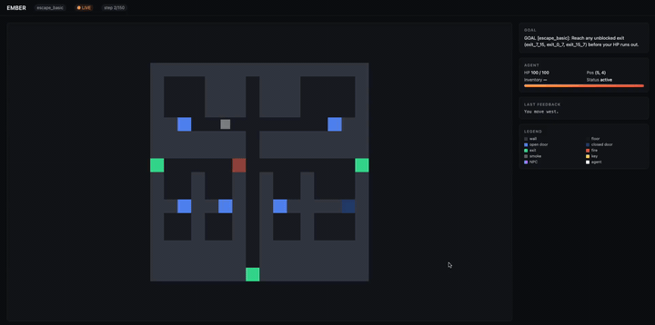

# Ember — an LLM agent in a virtual world

Ember places an LLM agent inside a 2D burning building. The agent reads
first-person narrative observations, picks one action per turn from a
small discrete grammar, and works toward a named, verifiable goal —
*escape*, *find the key and open the locked door*, or *rescue the
trapped NPC and escape together*. The fire simulates around it.

### Demo

A live `key_and_door` episode driven through the dashboard at
[`http://localhost:8000`](http://localhost:8000) — the agent picks up a
key, unlocks `door_3`, and steps through an exit:

<video src="assets/demo.mp4" controls width="720" muted playsinline>
  Your browser does not render embedded video. Download or open
  <a href="assets/demo.mp4">assets/demo.mp4</a> directly.
</video>

> Direct link: [`assets/demo.mp4`](assets/demo.mp4) (735 KB).



| Requirements| Where it lives |
| --- | --- |
| A virtual environment the agent can exist in | [`ember/env.py`](ember/env.py), [`ember/floor_plan.py`](ember/floor_plan.py), [`ember/fire_sim.py`](ember/fire_sim.py) |
| An observation format | [`ember/models.py`](ember/models.py) · `EmberObservation` |
| An action space the agent can use | [`ember/models.py`](ember/models.py) · `EmberAction` |
| LLM wired to observe → reason → act in a loop | [`examples/run_llm_agent.py`](examples/run_llm_agent.py) — ~150 lines |
| Demonstrate goal-directed task completion | [`ember/tasks.py`](ember/tasks.py) — 3 named tasks, plus traces in [`examples/traces/`](examples/traces/) |
| Design choices note | [`DESIGN.md`](DESIGN.md) |

---

## Install & run

```bash
# 1. Install
pip install -e ".[gemini]"             # env + Google Gemini SDK
pip install -e ".[server]"             # + FastAPI dashboard (for video recording)

# 2. Run the Gemini agent (in-process, fastest)
export GEMINI_API_KEY=...
python examples/run_llm_agent.py --task key_and_door --seed 11 --log run.jsonl

# 3. Random baseline (no key needed — sanity check)
python examples/run_random_agent.py --task escape_basic --episodes 5

# 4. BFS-scripted reference agent (no key needed — produces deterministic traces)
python examples/run_scripted_agent.py --task rescue --seed 11 \
    --log examples/traces/rescue_seed11.jsonl --verbose
```

The harness writes one JSONL record per step, including the exact
observation handed to the LLM, the LLM's reply (reasoning + JSON),
the parsed action, the world's feedback, and the reward. You can
read an entire episode by opening the file — no server needed.

---

## The harness (read this first)

### Observation

`EmberObservation` has two halves:

1. **`narrative`** — what the LLM reads. Free-form text, one block per
   step. The top line is always the active task's goal so the model
   can't forget what it's trying to do. The rest describes the
   surroundings, fire, smoke, audible signals, last action's outcome,
   and a list of legal actions for *this* situation.
2. **Structured fields** — `inventory`, `agent_health`, `visible_objects`,
   `blocked_exit_ids`, `available_actions_hint`, `task_complete`,
   `task_failed`, etc. Same information, machine-readable. Used by the
   random/scripted baselines, log analysis, and the HTTP dashboard.

A sample narrative the LLM actually sees:

```
GOAL [key_and_door]: (1) pick up key_1 at [3,2]  →  (2) (need key first) door_3 at [7,2]  →  (3) reach any exit

You are in the **west_rooms**. The air is **none**.
Health: ██████████ 100/100 (Good)  |  Wind: calm
No fire directly visible.
Exits visible: exit_0_8 at 5m west, exit_15_8 at 12m east.
Doors: door_3 (locked, closed) at 4m east, door_4 (open) at 3m south.
Last action: Episode started. Read the goal and assess your surroundings.
Available actions: move(direction='north')  move(direction='east')  pickup(target_id='key_1')  …
```

Why narrative + structured fields together? Narrative is what an LLM is
best at reasoning about; structured fields keep the env testable without
parsing English and let non-LLM agents (the random baseline, scripted
reference, future RL trainer) share the exact same world.

### Action space

```jsonc
{"action": "move",   "direction": "north"|"south"|"east"|"west"}
{"action": "door",   "target_id": "door_3", "door_state": "open"|"close"}
{"action": "pickup", "target_id": "key_1"}
{"action": "look",   "direction": "north"|"south"|"east"|"west"}
{"action": "wait"}
```

Five verbs. Cardinal moves only. `door` is its own verb (not bundled
into move) so the LLM can deliberately *close* a door to slow fire
spread or deliberately *unlock* one with a key. `look` is a cheap scan
that returns a description of up to 5 cells in one direction without
moving — useful when the agent wants more information before
committing.

Every observation already includes an `available_actions_hint` list
filtered for what's legal right now (you can't move into a wall, can't
open a non-adjacent door). The LLM can ignore the hints; the harness
just makes the legal set legible.

### The LLM loop

`examples/run_llm_agent.py` is the whole story:

```python
env = EmberEnvironment()
obs = env.reset(task="key_and_door", seed=11)

for turn in range(max_steps):
    messages.append({"role": "user", "content": build_user_prompt(obs)})
    reply, usage = call_gemini(client, model, messages[-2*history:])
    messages.append({"role": "assistant", "content": reply})

    action = parse_action(reply)                            # find last JSON object
    obs = env.step(action)
    log.write(json.dumps({...full step record...}) + "\n")

    if obs.done:
        break
```

`parse_action` greedily extracts the **last** JSON object in the LLM's
reply, so models that "think out loud" before emitting JSON are fine.
If no parseable JSON is found, the agent gets a `wait()` for the turn
— better than crashing the episode.

The script drives Google Gemini via `google-genai`. Set `GEMINI_API_KEY`
in your shell. The default model is `gemini-2.5-flash`; pass any other
ID with `--model`. Control the thinking budget with
`--thinking HIGH|MEDIUM|LOW|OFF` (default `HIGH`).

---

## The tasks

Three named goals, all sharing the same world, observation, and action
space. They differ only in what's placed at reset and what counts as
success.

| Task | What it tests | Set up by `tasks.py` |
| --- | --- | --- |
| `escape_basic` | Pure navigation under threat | One fire source; agent must reach any unblocked exit before HP runs out. |
| `key_and_door` | Sub-goal sequencing | Agent spawns inside a sealed room with a `key_1`; the room's only door is locked. Pick up the key, unlock the door, then escape. |
| `rescue` | Detour-then-escape | An `npc_1` marker is placed elsewhere in the building. Walking onto it counts as rescue. Then escape — escaping *without* rescuing first is a hard failure. |

Switch tasks via `env.reset(task="...")`. Difficulty is a per-task
property (slower fire and more time for `key_and_door` so the
sub-goal sequence is feasible), not a separate user-facing knob.

---

## Example trajectory: scripted agent on `key_and_door`

Trace excerpt from [`examples/traces/key_and_door_seed11.jsonl`](examples/traces/key_and_door_seed11.jsonl)
— produced by the BFS reference agent, identical world an LLM would
see:

```
turn 0  move(south)   → "You move south."
turn 1  move(east)    → "You move east."
turn 2  pickup(key_1) → "You pick up key_1. It's now in your inventory."
turn 3  move(north)   → "You move north."
turn 4  move(north)   → "You move north."
turn 5  door(door_3, open)
                      → "You unlock and open door 'door_3' with key_1."
turn 6  move(east)    → "You move east."
… (5 more navigation steps) …
turn 11 move(west)    → "You step through the exit and escape the building!"
SUCCESS — task_complete=True hp=100 inventory=['key_1']
```

The LLM run produces a structurally identical log, with each step's
`llm_reply` field preserving the model's free-form reasoning before the
JSON action — that's the "agent's mind" trace the prompt asks for.

---

## Actual Gemma 4 run — what happened

Trace: [`examples/traces/gemma_escape_basic_seed11.jsonl`](examples/traces/gemma_escape_basic_seed11.jsonl)

Command:

```bash
python examples/run_llm_agent.py \
    --task escape_basic --seed 11 \
    --model gemma-4-31b-it --thinking OFF \
    --max-steps 15 --step-delay 5 \
    --log examples/traces/gemma_escape_basic_seed11.jsonl
```

Result: **15 turns, did not escape, HP stayed at 100.** Aggregate stats:

| metric | value |
| --- | --- |
| turns | 15 |
| final HP | 100 / 100 (no fire damage taken) |
| task_complete | `False` (timed out, did not die) |
| avg latency / turn | 11.1 s (Gemma is slower than `gemini-2.5-flash`) |
| total prompt tokens | 26,248 |
| total tokens (incl. output + thoughts) | 31,386 |

What the trace shows: Gemma 4 read the goal correctly, identified
`exit_0_7` as the closest exit, and moved west toward it for the first
~4 turns. Then it lost the plan — turn 5 reply:

> *"I have entered an unknown area and the exit `exit_0_7` is now to the
> south, but moving south is not listed as an available action. I will
> move north to re-orient myself or return to the previous area."*

The model interpreted "`south` not in `available_actions_hint`" as
"unsolvable" rather than "wall blocked, try another direction or use
`look`," and oscillated N/S/E/W for the remaining turns. The full
reasoning per turn is in the trace file linked above.

To get a successful escape from a real model, try `--model
gemini-2.5-flash --thinking HIGH` (better instruction-following), or
`--max-steps 50 --seed 7` to give the same Gemma model more room to
recover.

---

## Run

Two ways to run the Gemini agent: **in-process** (fastest, for capturing
JSONL traces) or **HTTP-driven** (same harness, but the env is behind
the FastAPI server so the dashboard can watch — this is what you want
for a screen recording).

### A. In-process — just the log

```bash
pip install -e ".[gemini]"
export GEMINI_API_KEY=...

python examples/run_llm_agent.py \
    --task key_and_door \
    --seed 11 \
    --model gemini-2.5-flash \
    --thinking HIGH \
    --log run.jsonl
```

You get `run.jsonl`. One line per turn — each line carries the
observation handed to the LLM, the LLM's reasoning + JSON reply, the
parsed action, the world feedback, and the reward. Open it and read
the whole episode without re-running anything.

### B. With the live dashboard 

The server exposes a single-page HTML dashboard at `/` that polls
`/scene` every 250 ms and renders the grid, fire, smoke, doors, keys,
NPCs, and the agent in real time. Both the LLM harness and the BFS
scripted agent support `--use-http`, so you can drive the same
dashboard with either one.

**The 60-second recipe (no API key required):**

```bash
pip install -e ".[server]"

# ─── terminal 1 ─── start the server
uvicorn ember.server.app:app --port 8000
# leave this running

# ─── browser ─── open the dashboard
open http://localhost:8000          # macOS
# or visit http://localhost:8000 manually
# start your screen recorder NOW

# ─── terminal 2 ─── drive a clean deterministic demo
python examples/run_scripted_agent.py \
    --use-http http://localhost:8000 \
    --task key_and_door --seed 11 \
    --step-delay 0.6 --verbose \
    --log examples/traces/key_and_door_seed11_http.jsonl
```

`key_and_door seed=11` is the cleanest demo seed: 12 turns, agent picks
up the key, unlocks the door, escapes. At `--step-delay 0.6` that's
about 8 seconds wall-clock — slow enough to read each action on the
dashboard, fast enough for a single take.

**With Gemini instead of the scripted agent:**

```bash
pip install -e ".[gemini,server]"
export GEMINI_API_KEY=...                         
python examples/run_llm_agent.py \
    --use-http http://localhost:8000 \
    --task escape_basic --seed 11 \
    --model gemini-2.5-flash --thinking HIGH \
    --step-delay 0.5 --max-steps 30 \
    --log run.jsonl
```

Note Gemini free-tier rate limits: `gemini-2.5-flash` is 5 RPM, so set
`--step-delay 13` if you don't have a paid key.

`--use-http <URL>` flips the harness from the in-process env to the
HTTP one — same loop, but every reset/step is a POST against the
running server, which means the dashboard's `/scene` poll sees each
state change as it happens.

---

## Repo layout

```
ember/
├── README.md                    you are here
├── DESIGN.md                    observation, action space, what worked / didn't
├── pyproject.toml
├── assets/
│   └── demo.mp4                 dashboard recording shown above
├── ember/
│   ├── __init__.py
│   ├── models.py                EmberAction / EmberObservation / EmberState
│   ├── env.py                   reset / step / reward / observation assembly
│   ├── tasks.py                 escape_basic, key_and_door, rescue
│   ├── floor_plan.py            building templates
│   ├── fire_sim.py              cellular-automaton fire + smoke
│   ├── narrative.py             observation rendering
│   ├── rubrics.py               reward components
│   └── server/
│       ├── app.py               FastAPI wrapper (reset / step / scene / state)
│       └── dashboard.html       single-page UI polling /scene
└── examples/
    ├── run_llm_agent.py         the Gemini LLM harness — the headline file
    ├── run_random_agent.py      uniform-from-hints baseline
    ├── run_scripted_agent.py    BFS reference (in-process or --use-http)
    └── traces/
        ├── escape_basic_seed11.jsonl              scripted BFS reference
        ├── key_and_door_seed11.jsonl              scripted BFS reference
        ├── rescue_seed11.jsonl                    scripted BFS reference
        └── gemma_escape_basic_seed11.jsonl        real Gemma 4 31B run
```

---
